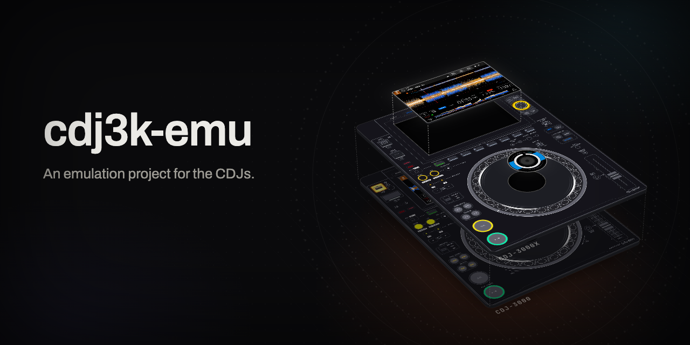
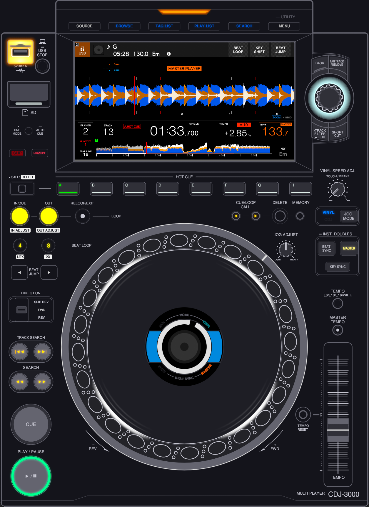

A macOS desktop app that boots CDJ's firmware inside QEMU on Apple Silicon,
surfacing the device's main LCD, jog LCD, jog wheel, faders, buttons, USB, PC-Link, and Pro DJ Link network in a native window.

<table>
<tr>
<td valign="top" width="50%">

<sub><em>Preview of the main emulation window</em></sub>
</td>
<td valign="middle" align="center" width="50%">
  
  <sub><em>Interacting with the firmware and controls</em></sub>
</td>
</tr>
</table>

## Why this exists

Built primarily for the technical challenge: figuring out what it takes to put
a piece of proprietary, tightly-coupled DJ hardware on a host hypervisor and
keep its real firmware happy. The interesting parts are the small surfaces
between a stock Linux kernel and the Pioneer userspace — DRM/KMS for the jog
LCD, the SPI sub-CPU protocol for the controls, the virtio-snd cadence shaping
that EP122's audio callback expects.

A secondary goal is having a reproducible bench for studying the **Pro DJ Link
(DJPL)** network protocol — beat broadcasts, master/slave hand-off, abs-pos
sync, the relationship between audible playback and what other players see on
the wire. Multiple emulator slots on the same host let you observe both ends of
a sync transaction with a packet capture between them, which is much harder to
do with real CDJs on a physical LAN when you're on vacation.

> [!TIP]
>
> ## What it is
>
> - A user-space wrapper around QEMU `aarch64-virt` running a vanilla Linux 6.6
>   kernel and a small set of out-of-tree modules + LD_PRELOAD shim that emulate
>   the Pioneer-specific hardware:
> - **virtio_snd** for audio (custom kernel module sized for the EP122 audio
>   callback cadence).
> - **subucom_virt** for the SPI sub-CPU protocol (buttons, jog encoder,
>   rotary, slider, capacitive sensors).
> - **deck_shim** (LD_PRELOAD) that emulates the Rockchip-specific DRM/KMS
>   ABI EP122 expects (jog LCD as DSI-2, vsync_time, etc.) and routes jog-LCD
>   pixels through ivshmem so the host renders them as an egui texture.

> [!CAUTION]
>
> ## What it is **not**
>
> - **It does not ship Pioneer firmware.** You need to supply your own copy
>   of the deck's firmware update file (`.UPD`) and decryption key at first launch.
>   The in-app **Install Firmware** wizard decrypts it locally and provisions
>   a per-instance eMMC qcow2 disk image under `~/Library/Application Support/com.cdj3k.emu/`.
>   Nothing Pioneer-owned is in this repository or the distributed bundle.
> - Not endorsed by, affiliated with, or sponsored by AlphaTheta Corporation /
>   Pioneer DJ. CDJ, rekordbox, and Pro DJ Link are trademarks of their
>   respective owners.
> - Not a frame-accurate hardware simulator. Pixel output and SPI timings are
>   faithful enough to drive EP122 / EP145 (the stock firmware), but the goal is a
>   daily-driver emulator, not a forensic recreation.
> - Not a turntable replacement. Jog wheel and rotary feel are reproduced via
>   pointer drag + scroll wheel; there's no support for an external MIDI
>   controller bridging into the emulated SPI bus.
> - Not currently portable. Apple Silicon macOS only (HVF, vmnet.framework,
>   AppKit window/menu, CoreAudio). Linux/Windows are out of scope for v0.1.
> - **Not compatible with pre-3.00 firmware.** See _Firmware compatibility_
>   below — on the CDJ-3000, only firmware 3.00 and newer is accepted.

## Firmware compatibility

> [!IMPORTANT]  
> On the CDJ-3000, cdj3k-emu accepts **firmware version 3.00 or newer** only.
>
> All CDJ-3000X firmwares are supported.

Pioneer shipped two different system-on-chip families across the CDJ-3000's
lifetime:

- **Renesas G2M** — used in firmware **1.x and 2.x**. Different kernel, very
  different driver stack, different DRM/KMS path for the jog LCD. cdj3k-emu
  does **not** support this hardware target.
- **Rockchip RK3399** — used in firmware **3.00 and newer**. This is the
  target cdj3k-emu emulates: vanilla Linux 6.6 aarch64 kernel, the
  `deck_shim` LD_PRELOAD, the `subucom_virt` SPI emulation, the
  `virtio_snd` audio pipeline are all written against the RK3399 userspace
  that the 3.00+ firmware ships.

If your `.UPD` decrypts to a Renesas-G2M kernel + rootfs the firmware wizard
will reject it before provisioning the eMMC image. Use a 3.00+ update file.

## Emulated models

`--model cdj3k` / `--model cdj3kx` (or `CDJ3K_MODEL`) names the model to
launch. A slot holds one installation, and its model is persisted in the
slot's settings (see [Storage](docs/storage.md)).

| Model         | Board / kernel             | Panel             | Status                    |
| ------------- | -------------------------- | ----------------- | ------------------------- |
| **CDJ-3000**  | RK3399, vanilla 6.6 kernel | 9-inch display    | Boots, Plays, Pro DJ Link |
| **CDJ-3000X** | RK3399, vanilla 6.6 kernel | 10.1-inch display | Boots, Plays, Pro DJ Link |

([Models and slates](docs/models.md)).

## About the decryption key

Pioneer ships firmware updates as `.UPD` files whose payload are LUKS-encrypted.
The "decryption key" the firmware wizard asks for is the LUKS keyfile
that unwraps that payload so we can mount it and extract the kernel + rootfs.

This repository does **not** ship that key, for the same reason it doesn't
ship the `.UPD` itself: it is Pioneer-controlled material and we have no right
to redistribute it. cdj3k-emu's posture is strict — nothing Pioneer-owned in
the repo, nothing Pioneer-owned in the bundle. Acquiring the keyfile is the
user's responsibility, by whatever means they are themselves entitled to.

## System requirements

- **macOS 13 (Ventura) or newer**, Apple Silicon (M1/M2/M3/M4).
- **macOS 15 (Sequoia) is strongly recommended.** cdj3k-emu auto-detects
  the host version at every spawn:
  - 15+ → QEMU uses Apple's **in-kernel ARM vGIC** (`hv_gic_create`).
    Drops the per-IRQ vCPU-exit cost dramatically. EP122's chatty IRQ
    pattern is the dominant cost driver for HVF guests, so this is a
    big perf win on 15+.
  - 13 / 14 → QEMU falls back to **userspace GIC emulation**
    (`kernel-irqchip=off`). Functional but noticeably more CPU per
    instance; you'll feel it most when running multiple slots at once.
- Roughly 8 GB free RAM if you plan to run two instances at once
  (1.5 GB guest each + host overhead).
- A copy of a supported model firmware update file and its decryption key (if needed).

## Known limitations

- Audio is not a bit-perfect reproduction of the real hardware. The CDJ-3000
  ships dedicated audio silicon with its own clock domain and DSP path; we
  re-route the firmware's PCM through `virtio_snd` -> a QEMU bypass ring ->
  CoreAudio, which is a fundamentally different pipeline. Occasional pops
  and transient artifacts can occur, especially under host CPU pressure or
  when the macOS HAL device clock drifts against the guest. A large amount
  of work has gone into mitigations (lock-free SPSC ring, dedicated RT
  writer thread, soft-PLL clock-skew correction, pipeline-depth watchdog,
  RELEASE-flush on recovery) - see `docs/audio-stack.md` for the full
  pipeline. Steady-state output on a matched-rate device is clean, but the
  result is not forensically identical to a physical CDJ-3000.
- Audio latency depends on macOS CoreAudio queue depth - typically 30-80 ms
  end-to-end with the bundled bypass-ring patches. ALC ("Enable ALC") shifts
  the audible / Pro DJ Link broadcast alignment to compensate but adds a
  bit of jitter; default-on.
- Jog wheel feel is "good enough for cueing" — no torque feedback.
  Brake stop-time map matches the device's `jog_adjust` rotary, so
  the _cadence_ of stops is faithful even if the touch isn't.
- Service Mode (**Emulation → Service Mode**, or `--service-mode`) boots the sub-CPU test mode through an injected button sequence, and is flaky if the emulation speed isn't adequate.  
  Some test routines that touch hardware-only registers (e.g. fan-RPM read) return fixed values.
- LINK MODE (Rekordbox ← network → Emulation) is not working.
- PC Link (USB-B) **Rekordbox is gated** by its real HID probing and won't
  connect. USB audio (UAC2) is **not supported**.

## Controls

### Jog wheel

You can control the jog wheel a few different ways:

- **Click and drag the center** — for scratching effects.
- **Click and drag the outside ring** — for a subtle pitch bend.
- **Scroll the mouse wheel** anywhere on the jog — also bends pitch.
- **Hold Ctrl, click-and-drag, then release ("slingshot")** — gives the wheel a flick, which is shown as a line. The faster you pull, the more spin you get.

### Using multiple controls at once

On a real CDJ, you can hold a button or touch the screen while doing something else, like turning the jog wheel. With a mouse, there's only one pointer, so you can hold **Ctrl** to "latch" a button or touchscreen press:

- **Ctrl + click a button** — the button stays pressed until you let go of Ctrl.
- **Ctrl + click the LCD touchscreen** — touch stays down until you release Ctrl.

This lets you, for example, keep `Search Forward` held down while moving the jog wheel to search faster, just like on real hardware.

## Deck mods

The [cdj3k-mods](https://github.com/nsaintot/cdj3k-mods) feature set (Gate Cue,
MOD SETTINGS, Themes, STEMS, X-PAD) is not built here and the emulator installs
none of it. The mods ship as their own LD_PRELOADed object from that project's
releases, loaded alongside `deck_shim.so` — `LD_PRELOAD` takes a
colon-separated list.

STEMS needs a [stemd](https://github.com/nsaintot/stemd) server on the LAN.

## Building

```bash
git clone https://github.com/nsaintot/cdj3k-emu

# 1. Build QEMU (clones upstream, applies our shm-display patch, ~10 min).
./qemu/build.sh

# 2. Build the aarch64 kernel, out-of-tree modules, the shim, and guest
#    tools (Docker). `make abi-check` gates the shim against the deck's glibc.
./build.sh

# 3. Assemble the .app bundle. The Homebrew dylibs QEMU links against are
#    copied into the bundle and rewritten to @loader_path, so the .app runs
#    on a Mac without Homebrew.
./bundle.sh                # ad-hoc signed (HVF works, FDA does not)
./bundle.sh --sign "Apple Development"   # real cert (enables Full Disk Access)
./bundle.sh --sign "Developer ID Application" --dmg   # distributable .dmg

# or, optionally, a Release build: Developer ID + notarized + stapled .app and .dmg.
#    One-time: store notary credentials (app-specific password from appleid.apple.com) under a keychain profile:

xcrun notarytool store-credentials cdj3k-emu-notarization --apple-id <APPLE_ID> --team-id <TEAM_ID>
./bundle.sh --sign "Developer ID Application" --dmg --notarize
```

## First-run privilege prompts

cdj3k-emu asks for the macOS admin password in three specific situations,
**only when you ask it to**:

| Action                                                   | Why it elevates                                                                                                                                                                                                        |
| -------------------------------------------------------- | ---------------------------------------------------------------------------------------------------------------------------------------------------------------------------------------------------------------------- |
| Bridging a TAP interface (OpenVPN-style) for Pro DJ Link | Creates a macOS kernel bridge with `ifconfig`, which is root-only. vmnet modes need no prompt: QEMU opens the interface itself under the app's `com.apple.developer.networking.vmnet` entitlement.                     |
| Selecting a TAP interface (OpenVPN etc.)                 | Creates a macOS `bridge` device + assigns a `tap` device to QEMU via Authorization Services. Torn down automatically when the app exits.                                                                               |
| Attaching a physical USB drive in pass-through mode      | `chmod 660` on `/dev/diskN` so QEMU can open it `O_RDWR`. The exact device path is validated against `/dev/disk[0-9]+(s[0-9]+)?` before elevation — see `crates/cdj3k-emu-runtime/src/usb.rs::is_valid_bsd_disk_path`. |

All three use the native macOS password dialog (TouchID / Apple Watch eligible)
via `AuthorizationServices`, not a CLI prompt. None of them grant ongoing
privileges — every elevation is scoped to one command.

## Documentation and reference

- [Audio stack](docs/audio-stack.md)
- [ALC](docs/alc.md)
- [Network stack](docs/network.md)
- [Storage](docs/storage.md)
- [PC-Link](docs/pc-link.md)
- [Models and slates](docs/models.md)
- [Host/guest stream transports](docs/stream-transports.md)
- [subucom SPI protocol](docs/subucom.md)
- [G2M (Renesas) — unsupported target](docs/g2m-renesas.md)

## Repository layout

```
app/cdj3k-emu/       binary (eframe egui app + runtime worker)
crates/cdj3k-emu-*   Rust workspace: panel, streams, platform, ui,
                     runtime, storage, firmware
  ui/src/app/ui/       shared control toolkit + slate/{cdj3k,cdj3kx}
guest/               C sources built for the guest:
  cfgd/                cdj3k-cfgd  - virtio-serial config daemon
  deck_shim/           deck_shim.so - LD_PRELOAD shim (core/ + per-model)
  subucom/             subucom_forwarder, subucom_live
  pc_link_bridge/      cdj3k-pc-link-bridge - USB-B gadget <-> host bridge
  modules/             out-of-tree kernel modules (subucom_virt, virtio_snd, udev_usb1)
  kernel-patches/      vanilla 6.6 patches + the guest kernel .config
qemu/                upstream QEMU source + our overlay patches
docker/              Alpine + Ubuntu build pipeline for guest artefacts
initramfs-patch/     numbered rootfs patch scripts (concatenated by bundle.sh)
scripts/             bundle-dylibs.sh (self-contained .app)
```

## License

cdj3k-emu's original sources are dual-licensed at your option under either of:

- **Apache License, Version 2.0** ([LICENSE-APACHE](LICENSE-APACHE))
- **MIT License** ([LICENSE-MIT](LICENSE-MIT))

Linux kernel modules in `guest/modules/`, kernel patches in
`guest/kernel-patches/`, the QEMU embedding shim in `qemu/shim/`, and QEMU
patches in `qemu/patches/` are derivatives of GPL-2.0 upstreams and retain
**GPL-2.0-or-later**. See [NOTICE](NOTICE) for a full inventory of bundled
third-party components and the firmware-acquisition expectation.

## Contributing

Issues and pull requests welcome. By submitting a contribution you agree it
is dual-licensed Apache-2.0 / MIT per [LICENSE-APACHE](LICENSE-APACHE) and
[LICENSE-MIT](LICENSE-MIT), except for contributions inside the GPL-2.0
carve-outs listed in [NOTICE](NOTICE), which remain GPL-2.0-or-later.
